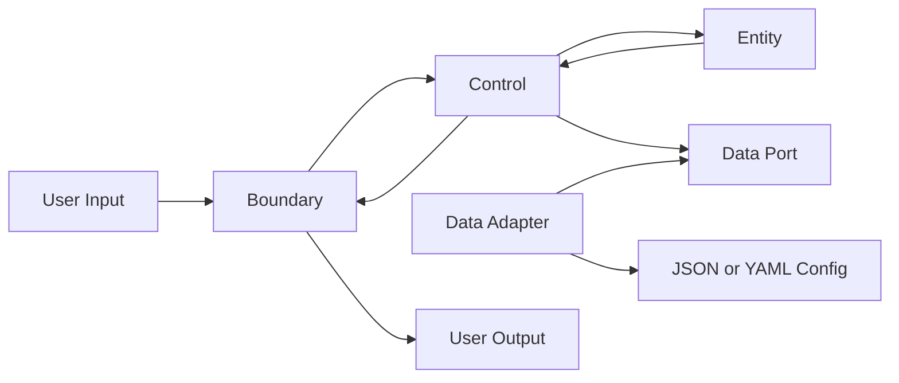

# UnitConverter (C++)

C++/클린 아키텍처 학습자가 길이 단위 변환 문제를 통해 계약 정의, 테스트 우선 개발, 레이어 분리, 회귀 보호를 학습하는 프로젝트입니다.

## 목차

- [개요 (Overview)](#개요-overview)
- [빠른 시작 (Quick Start)](#빠른-시작-quick-start)
- [지원 단위 및 비율](#지원-단위-및-비율)
- [입력 형식 계약](#입력-형식-계약)
- [아키텍처](#아키텍처)
- [테스트 실행](#테스트-실행)
- [설정 파일 (JSON/YAML)](#설정-파일-jsonyaml)
- [출력 포맷](#출력-포맷)
- [기여 가이드 (Contributing)](#기여-가이드-contributing)
- [라이선스](#라이선스)

## 개요 (Overview)

이 프로젝트는 `meter`, `feet`, `yard` 변환이라는 작은 도메인을 사용해 단순 계산이 아닌 소프트웨어 계약 설계를 학습하는 과제입니다. 학습자는 입력 형식, 음수 정책, 미지원 단위 처리, 변환 비율, 출력 표현을 먼저 고정하고 이를 테스트로 검증합니다.

주요 학습 목표:

- OCP: 새 단위를 추가해도 기존 변환 규칙 변경을 최소화합니다.
- SRP: 입력 검증, 변환 규칙, 출력 포맷 책임을 분리합니다.
- BCE: Boundary, Control, Entity 레이어로 책임과 의존성 방향을 고정합니다.
- TDD: Catch2 기반 RED-GREEN-REFACTOR 흐름으로 계약을 먼저 고정합니다.

PRD 연결: 본 README는 Phase 5 PRD의 기능 요구사항, 인수 기준, 회귀 보호 규칙을 사용자용 문서로 이관한 문서입니다.  
PRD 문서: [docs/PRD.md](./docs/PRD.md)

## 빠른 시작 (Quick Start)

### 사전 조건

| 항목 | 요구사항 |
|---|---|
| C++ | C++17 이상 |
| 빌드 도구 | CMake |
| 테스트 프레임워크 | Catch2 |

### 빌드 & 실행

```sh
cmake -S . -B build
cmake --build build
./build/UnitConverter
```

### 예시 입출력

입력:

```text
meter:5.0
```

출력 예시:

```text
5.0 meter = 5.0 meter
5.0 meter = 16.4042 feet
5.0 meter = 5.46805 yard
```

## 지원 단위 및 비율

| 단위명 | 식별자 | meter 기준 비율 | 출처 |
|---|---|---|---|
| meter | `meter` | `1 meter = 1 meter` | PRD 5.1 |
| feet | `feet` | `1 meter = 3.28084 feet` | PRD 5.1 |
| yard | `yard` | `1 meter = 1.09361 yard` | PRD 5.1 |

`feet`와 `yard` 간 변환은 직접 비율이 아니라 `meter` 기준값을 경유합니다.

## 입력 형식 계약

입력 형식은 다음 문자열 계약을 따릅니다.

```text
<unit>:<amount>
```

### 정상 입력

```text
meter:1
feet:3.28084
yard:1.09361
```

### 비정상 입력

| 입력 | 오류 코드 | 에러 메시지 패턴 |
|---|---|---|
| `meter` | `INVALID_FORMAT` | `Invalid input format. Expected '<unit>:<amount>'.` |
| `meter:2.5.1` | `INVALID_NUMBER` | `Invalid number for amount.` |
| `meter:-1` | `NEGATIVE_VALUE` | `Amount must be greater than or equal to 0.` |
| `mile:1` | `UNKNOWN_UNIT` | `Unknown unit: <unit>.` |

음수 길이는 실제 길이 값으로 인정하지 않으며, 변환 전에 `NEGATIVE_VALUE` 오류로 거부합니다.

## 아키텍처



### 의존성 방향

| 레이어 | 책임 |
|---|---|
| Boundary | 입력 파싱, 입력 검증, 출력 직렬화, 오류 메시지 표현 |
| Control | 변환 실행 흐름, 단위 등록 흐름, Data Port 호출 |
| Entity | 단위 정의, meter 허브 변환 규칙, 변환 결과, 도메인 불변식 |
| Data | 설정 파일 로드, 저장소 어댑터, 단위 정의 제공 |

의존성은 `Boundary -> Control -> Entity` 방향을 따릅니다. Entity는 콘솔, 파일, JSON, CSV, Table 포맷을 알지 않습니다.

### 새 단위 추가 방법

1. 새 단위명을 정합니다.
2. `1 <unit> = <meter_ratio> meter` 형식으로 meter 기준 비율을 정합니다.
3. 단위 레지스트리에 등록합니다.
4. 기존 `meter`, `feet`, `yard` 회귀 테스트를 다시 실행합니다.
5. 새 단위 변환 결과가 meter 허브 기준으로 계산되는지 검증합니다.

## 테스트 실행

테스트 프레임워크는 Catch2로 고정합니다.

```sh
ctest --test-dir build
```

커버리지 목표:

| 영역 | 목표 |
|---|---|
| Domain | 라인 `95%` 이상, 분기 `90%` 이상 |
| Boundary | 라인 `90%` 이상, 오류 코드별 테스트 `100%` |
| Data | 라인 `85%` 이상, 설정 실패 유형별 테스트 `100%` |
| Integration | 정상 경로 `3개` 이상, 실패 경로 `5개` 이상 |

## RED 단계 To-Do 리스트

> 이 체크리스트는 test_plan.md 기반으로 생성되었습니다.
> 각 항목은 RED(실패 테스트 작성) 완료 시 체크합니다.

### Track A — UI / Boundary 테스트

- [ ] TC-A-01: 정상 입력 "meter:2.5" → 변환 결과 반환 (Happy Path)
- [ ] TC-A-02: ":" 없는 입력 → std::invalid_argument 발생
- [ ] TC-A-03: 음수 입력 "meter:-1.0" → std::invalid_argument 발생
- [ ] TC-A-04: 없는 단위 "parsec:1.0" → std::invalid_argument 발생
- [ ] TC-A-05: 소수점 파싱 실패 "meter:abc" → std::invalid_argument 발생
- [ ] TC-A-06: 출력 포맷에 원 입력 단위·값 보존 ("2.5 meter = ...")
- [ ] TC-A-07: value=0 경계값 처리 확인

### Track B — Domain / Logic 테스트

- [ ] TC-B-01: convert("meter", 2.5, "feet") == 8.20210 (오차 1e-5)
- [ ] TC-B-02: convert("meter", 1.0, "yard") == 1.09361 (오차 1e-5)
- [ ] TC-B-03: convert("feet", 1.0, "meter") == 0.30480 (역변환)
- [ ] TC-B-04: convertAll("meter", 1.0) → 모든 등록 단위 변환 반환
- [ ] TC-B-05: registerUnit("cubit", 0.4572) 후 변환 가능
- [ ] TC-B-06: loadConfig(유효한 경로) → 비율 정상 로드
- [ ] TC-B-07: loadConfig(없는 경로) → 기본값(3.28084/1.09361) 유지

### 커버리지 목표

- [ ] Domain Logic: 95%+ (# gcov / lcov)
- [ ] Boundary Layer: 85%+
- [ ] 전체 TOTAL: 90%+

### 결함 목록 연결

- [x] [defect_list.md](./defect_list.md) 생성 및 발견 결함 기록
- [ ] 모든 결함 수정 후 회귀 테스트 통과 확인

## 설정 파일 (JSON/YAML)

설정 파일은 단위 정의를 외부화하기 위한 선택 기능입니다.

권장 위치:

```text
config/units.json
config/units.yaml
```

### JSON 예시

```json
{
  "units": [
    {
      "name": "meter",
      "toMeterRatio": 1.0
    },
    {
      "name": "feet",
      "toMeterRatio": 0.3047999902464
    },
    {
      "name": "yard",
      "toMeterRatio": 0.9144027578387
    }
  ]
}
```

### YAML 예시

```yaml
units:
  - name: meter
    toMeterRatio: 1.0
  - name: feet
    toMeterRatio: 0.3047999902464
  - name: yard
    toMeterRatio: 0.9144027578387
```

### 동적 단위 등록 예시

등록 입력 형식:

```text
register:<unit>:<meter_ratio>
```

예시:

```text
register:cubit:0.4572
```

계약:

- `<unit>`은 비어 있을 수 없습니다.
- `<meter_ratio>`는 `0`보다 큰 숫자여야 합니다.
- 이미 등록된 단위명은 중복 등록 오류로 거부합니다.
- 등록 성공 후 새 단위는 변환 대상 목록에 포함됩니다.

## 출력 포맷

### 콘솔 기본 포맷

```text
<source_amount> <source_unit> = <converted_amount> <target_unit>
```

예시:

```text
5.0 meter = 5.0 meter
5.0 meter = 16.4042 feet
5.0 meter = 5.46805 yard
```

소수 비교 허용 오차는 테스트에서 `0.000001`로 고정합니다.

### JSON 출력

```json
{
  "status": "success",
  "format": "json",
  "source": {
    "amount": 5.0,
    "unit": "meter"
  },
  "results": [
    {
      "targetUnit": "meter",
      "value": 5.0
    },
    {
      "targetUnit": "feet",
      "value": 16.4042
    },
    {
      "targetUnit": "yard",
      "value": 5.46805
    }
  ]
}
```

### CSV 출력

```csv
source_amount,source_unit,target_unit,converted_amount
5.0,meter,meter,5.0
5.0,meter,feet,16.4042
5.0,meter,yard,5.46805
```

## 기여 가이드 (Contributing)

- 브랜치 운영은 [docs/branch-strategy.md](./docs/branch-strategy.md)의 Dual-Track RED-GREEN-REFACTOR 흐름을 따릅니다.
- README 기준 비율은 계약 테스트 없이 변경하지 않습니다.
- 오류 코드와 오류 메시지 패턴은 계약 테스트 없이 변경하지 않습니다.
- 입력 형식 `<unit>:<amount>`는 계약 테스트 없이 변경하지 않습니다.
- 테스트 없는 PR은 거부합니다.
- 새 단위 추가 PR은 기존 `meter`, `feet`, `yard` 회귀 테스트 통과를 포함해야 합니다.
- 리팩터링은 관련 테스트가 Green 상태일 때만 진행합니다.

커밋 메시지 컨벤션:

```text
test: add contract test for negative length input
feat: add dynamic unit registration contract
fix: reject malformed decimal amount
docs: update README output contract
refactor: separate boundary validation from conversion rule
```

## 라이선스

MIT License. 학습용 프로젝트입니다.
